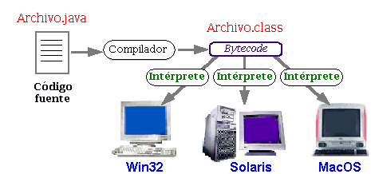

# Interpreted And Compiled Programming Languages

Lenguaje compilado:

un lenguaje compilado es un lenguaje de programación que generalmente se compila y no se interpreta. Es aquella donde el programa, una vez compilado, se expresa en las instrucciones de la máquina de destino; este código de máquina es indescifrable para los humanos. Tipos de lenguaje compilado: C, C++, C#, CLEO, COBOL, etc.

Lenguaje interpretado:

un lenguaje interpretado es un lenguaje de programación que generalmente se interpreta, sin compilar un programa en instrucciones de máquina. Es uno en el que las instrucciones no son ejecutadas directamente por la máquina de destino, sino que son leídas y ejecutadas por algún otro programa. Rangos de idiomas interpretados: JavaScript, Perl, Python, BASIC, etc.

## Diferencia de lenguaje interpretado y compilado

| Interpretado |Compilado |
| ----------- | ----------- |
| Un lenguaje compilado es un lenguaje de programación cuyas implementaciones suelen ser compiladores y no intérpretes. | Un lenguaje interpretado es un lenguaje de programación cuyas implementaciones ejecutan instrucciones directa y libremente, sin compilar previamente un programa en instrucciones en lenguaje máquina. |
| En este lenguaje, una vez que se compila el programa, se expresa en las instrucciones de la máquina de destino. | Mientras está en este idioma, las instrucciones no son ejecutadas directamente por la máquina de destino. |
| Hay al menos dos pasos para pasar del código fuente a la ejecución. | Solo hay un paso para pasar del código fuente a la ejecución. |
| En este lenguaje, los programas compilados se ejecutan más rápido que los programas interpretados. | Mientras están en este idioma, los programas interpretados se pueden modificar mientras el programa se está ejecutando.|
| En este lenguaje, los errores de compilación impiden que el código se compile. | En estos lenguajes, toda la depuración ocurre en tiempo de ejecución. |
| El código del lenguaje compilado puede ser ejecutado directamente por la CPU de la computadora. | Un programa escrito en un lenguaje interpretado no se compila, se interpreta. |
|Este lenguaje ofrece un mejor rendimiento. | Este lenguaje ofrece un rendimiento relativamente más lento. |

## Java es un lenguaje interpretado o compilado 

La mayoría de los lenguajes de programación se caracterizan por ser interpretados o compilados, lo que determina la manera en como serán ejecutados en una computadora.

Java tiene la característica de ser al mismo tiempo compilado e interpretado. El compilador es el encargado de convertir el código fuente de un programa en un código intermedio llamado bytecode que es independiente de la plataforma en que se trabaje y que es ejecutado por el intérprete de Java que forma parte de la Máquina Virtual de Java.

