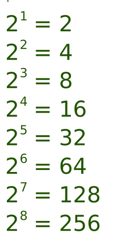

# ¿Tu fecha de nacimiento en la matriz?

## Descripción

Tu equipo acaba de ver la película "Matrix" y te han preguntado cómo se escribiría en binario el número de tu año de nacimiento. Debes aprender a traducir tu fecha de nacimiento a binario y mostrárselo a tu equipo. (No utilice una página web o una herramienta para convertir su fecha de nacimiento)

## Convertir 1990 a Binario

| 2^10 | 2^9 | 2^8 | 2^7 | 2^6 | 2^5 | 2^4 | 2^3 | 2^2 | 2^1 | 2^0 |
| ---- | --- | --- | --- | --- | --- | --- | --- | --- | --- | --- |
| 1    | 1   | 1   | 1   | 1   | 0   | 0   | 0   | 1   | 1   | 0  |

`Decimal`: 1990

la repuesta seria 

`Binario`: 11111000110

